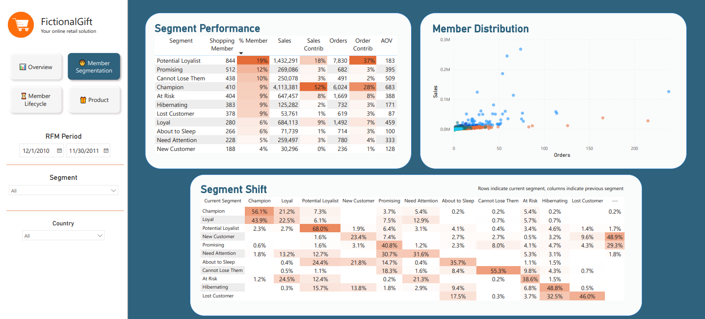
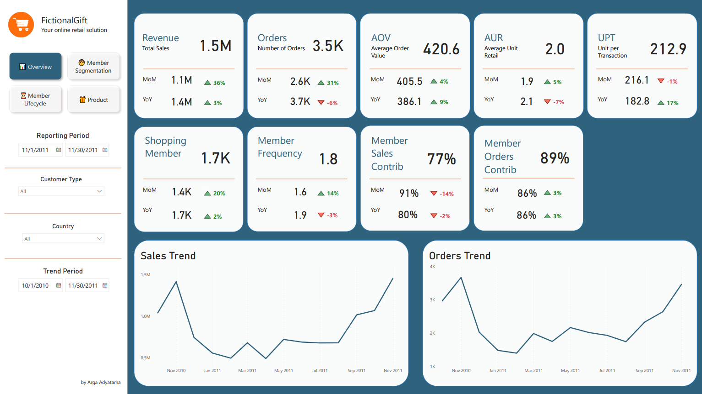
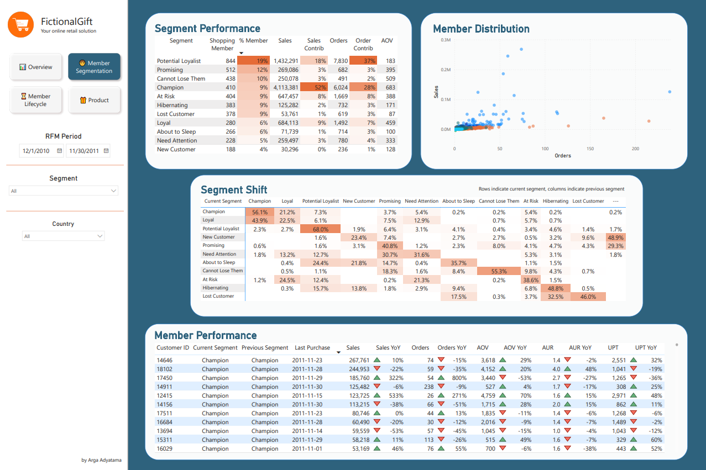
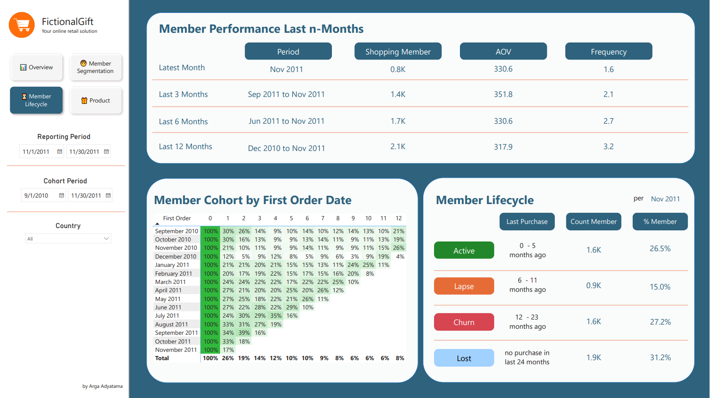
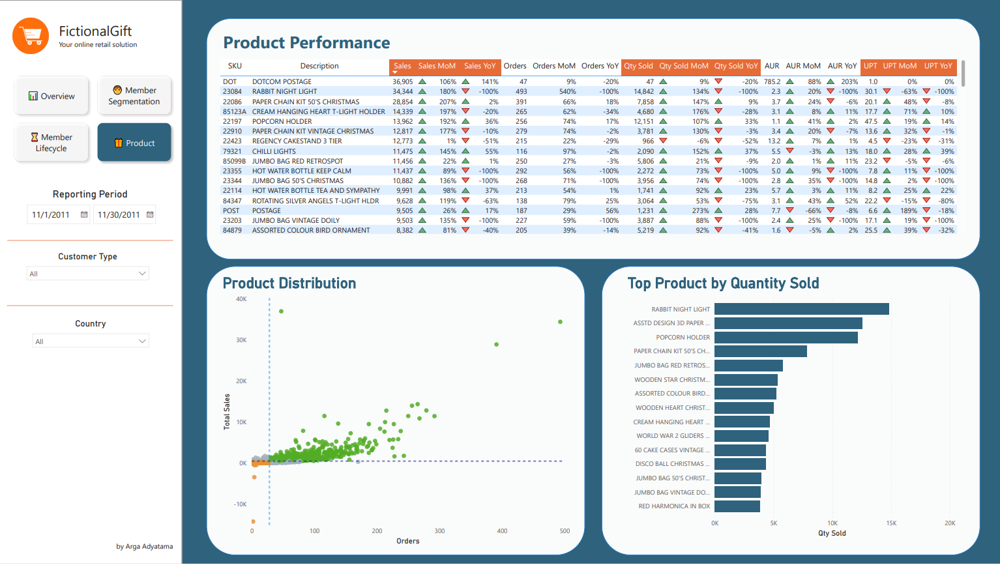

# Online Retail Customer Segmentation Dashboard

This is my personal project to learn how to build a customer segmentation dashboard in Power BI. The main showcase of this project is an RFM segmentation that will change dynamically based on the selected transaction period. The data is acquired from [Kaggle](https://www.kaggle.com/datasets/mashlyn/online-retail-ii-uci). It contains transactions of a an online retail transactions for a UK-based and registered online retail between 2009-12-01 and 2011-12-09. The company mainly sells unique all-occasion gift-ware. Customers who have transacted on the store can be divided into two group: member (those with customer id) and guest (those with no customer id).

## Attachment

* [Data Preprocessing](https://colab.research.google.com/drive/1A4r89b5zZxXJYu3OOknR_Aq7H823qa75?usp=sharing)
* [Dashboard Page](https://github.com/Argaadya/online_retail_customer_dashboard/blob/main/online_retail_dashboard.pdf)
* [Demo](https://drive.google.com/drive/folders/19Ji-sKU-oRiUQvt8PUKHX3Ztyox9foOZ?usp=drive_link)
* [Raw pbix file](https://github.com/Argaadya/online_retail_customer_dashboard/blob/main/online_retail_dashboard.pbix)

## Data Preprocessing

The following are steps that I have done to process the data before feeding it into Power BI:

* Data type 
  - change invoice_time object to timestamp
  - change customer_id from float to string

* Data cleansing/manipulation
  - create new column invoice_date that only contains the date and no time
  - create sales column from quantity * price
  - uppercase and remove leading and trailing whitespace of all ID to prevent duplicate entries or unmatched data
  - remove duplicated data on row level (if 2 or more rows has identical values on all columns)
  - create flag_customer column to indicate if a customer Member (has customer_id) or Guest (NULL customer_id)
  - replace the description/name of the sku with the latest name for each sku to help fill the missing value
  - create new table called master_item that consists of the sku and its respective description name
  - remove description column from the main online_retail transaction table

## The Dashboard Structure

The dashboard consists of 4 different pages:

* Overview: the general performance metrics
* Member Segmentation: segmenting customer into 11 different groups based on RFM model
* Member Lifecycle: member cohort retention, member engagement in last 12 months, and member lifecycle based on their last purchase period
* Product: the performance of each product

### Overview

The page shows business metrics as well as membership metrics:

- Revenue: total sales generated
- Orders: number of orders/unique invoice
- AOV: average order value, the average of sales generated per order
- AUR: average unit retail, the average value of item purchased per quantity
- UPT: unit per transaction, the average quantity of item purchased per order
- Shopping Member: number of unique transacting member
- Member Frequency: the average number of order per member
- Member Sales Contrib: percentage of sales generated by member compared to total sales
- Member Orders Contrib: percentage of order by member compared to total order

You can slice the data based on the transaction period, the customer type (member/guest) and the country of delivery. It also shows the monthly trend for sales and order to help tracking if the company is growing.

### Member Segmentation

Shows the rfm segment of each customer based on the selected period (typically in year of transactions). The top left table shows the number of member on each segment and their total sales, order, and overall AOV per segment. The top right scatterplot shows the distribution of each member based on the number of order and sales. The segment shift table help to track the composition of current segment based on the status of each member on previous period (*RFM Period* - 1 month). For example, if the current number of champion 400 people and the cell of Champion-Champion shows 56%, it means that out of 400 people who is a Champion on the selected period, 56% of them is a Champion as well in previous period. The bottom table shows the performance of each member and their segment category.

### Member Lifecycle

The page shows the information about member lifecycle and help monitor member retention. The table on top shows the number of shopping member, AOV, and member frequency of the last-n months. The period is based on the maximum date selected from the selected date on the *Reporting Period* slicer, so if you choose 2010-1-1 to 2011-11-30, the latest month would be from 2011-1-1 to 2011-11-30 while the last 3 months would be from 2011-9-1 to 2011-11-30. The bottom left shows the retention of member based on their first order cohort, with the percentage shows how many member from those cohort are still transacting on n-month after their first order. The bottom right table shows the proportion of member based on their last purchase date. 

### Product

The page shows the detailed performance for each sku sold on the store. You can slice the data based on the transaction period, the customer type (member/guest) and the country of delivery. The table shows the performance of each sku and the comparison to last month and last year of the same period to help monitoring which product is growing and which one is declining. The scatterplot help visualize the distribution of total order and sales generated by each sku, see if there is any outliers in term of performance. The bar chart help to visualize the top 15 product sold by quantity. Unfortunately there is no product category information to show and monitor.

